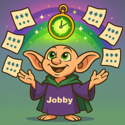

# Jobby  



High-performance and reliable .NET library for background tasks, designed for distributed applications.

- Website (not available yet)
- [Versions history](https://github.com/fornit1917/jobby/tree/master/versions.md)
- [Samples](https://github.com/fornit1917/jobby/tree/master/samples)
- [Usage Guide in Russian](https://github.com/fornit1917/jobby/tree/master/docs/ru/overview.md)


## Key Features  

- Scheduled tasks  
- Queue-based task execution  
- Transactional creation of multiple tasks  
- Configurable execution order for multiple tasks  
- Retry policies for failed tasks
- Configurable middlewares pipeline for executing background tasks code
- OpenTelemetry-compatible metrics and tracing
- Proper operation in distributed applications
- Fault tolerance and component failure resilience  
- High performance  
- Low resource consumption on both .NET application and database sides  

## Usage Guide  

### Installation  

To use Jobby, install the Jobby.Core package and a storage package (currently only PostgreSQL is supported):  

```
dotnet package add Jobby.Core  
dotnet package add Jobby.Postgres  
```

For ASP.NET Core integration, also install the Jobby.AspNetCore package:  

```
dotnet package add Jobby.AspNetCore  
```

### Defining Background Tasks  

To define a background task, implement the `IJobCommand` interface for the task parameters and `IJobCommandHandler` for the task logic:  

```csharp
public class SendEmailCommand : IJobCommand  
{  
    // Properties can contain any parameters to be passed to the task  
    public string Email { get; init; }  

    // Return a unique name identifying the task  
    public static string GetJobName() => "SendEmail";  

    // Return a flag indicating whether the task can be automatically restarted  
    // if the executing server is presumed to have failed.  
    // Recommended to return true only for idempotent tasks.  
    public bool CanBeRestarted() => true;  
}  

public class SendEmailCommandHandler : IJobCommandHandler<SendEmailCommand>  
{  
    // Dependency injection is supported when using Jobby.AspNetCore  
    private readonly IEmailService _emailService;  
    public SendEmailCommandHandler(IEmailService logger)  
    {  
        _logger = logger;  
    }  

    public async Task ExecuteAsync(SendEmailCommand command, JobExecutionContext ctx)  
    {  
        // Implement your task logic here  
        // command - task parameters  
        // ctx - contains cancellationToken and additional task execution info  
    }  
}  
```

### Library Configuration  

#### ASP.NET Core Configuration  

To add Jobby to an ASP.NET Core application, use the `AddJobbyServerAndClient` extension method:  

```csharp
builder.Services.AddSingleton<NpgsqlDataSource>(NpgsqlDataSource.Create(databaseConnectionString));

builder.Services.AddJobbyServerAndClient(jobbyBuilder =>  
{
    // Specify assemblies containing your IJobCommand and IJobCommandHandler implementations  
    jobbyBuilder.AddJobsFromAssemblies(typeof(SendEmailCommand).Assembly);

    // Configure jobby
    jobbyBuilder.ConfigureJobby((serviceProvider, jobby) => {
        jobby.UsePostgresql(serviceProvider.GetRequiredService<NpgsqlDataSource>());  
        jobby.UseServerSettings(new JobbyServerSettings  
        {  
            // Maximum number of concurrently executing tasks  
            MaxDegreeOfParallelism = 10,  

            // Maximum number of tasks fetched from queue per query  
            TakeToProcessingBatchSize = 10,  
        });
        jobby.UseDefaultRetryPolicy(new RetryPolicy  
        {  
            // Maximum number of task execution attempts  
            MaxCount = 3,  

            // Delays between retry attempts (in seconds)  
            IntervalsSeconds = [1, 2]
        });
    }); 
});  
```

To control how sequences behave after a final failure, configure PostgreSQL storage (default is `SequenceFailureBehavior.Block`):  

```csharp
jobby.UsePostgresql(pg =>
{
    pg.UseDataSource(serviceProvider.GetRequiredService<NpgsqlDataSource>());
    pg.UseSequenceFailureBehavior(SequenceFailureBehavior.Continue);
});
```

Full ASP.NET Core example: [Jobby.Samples.AspNet](https://github.com/fornit1917/jobby/tree/master/samples/Jobby.Samples.AspNet).  

#### Non-ASP.NET Core Configuration  

For non-ASP.NET Core usage, create a `JobbyBuilder` instance:  

```csharp
var jobbyBuilder = new JobbyBuilder();  
jobbyBuilder  
        .UsePostgresql(dataSource)  
        // scopeFactory - your custom scope factory implementation  
        .UseExecutionScopeFactory(scopeFactory)  
        .AddJobsFromAssemblies(typeof(SendEmailCommand).Assembly);  

// Service for creating tasks  
var jobbyClient = builder.CreateJobbyClient();  

// Background task execution service  
var jobbyServer = builder.CreateJobbyServer();  
jobbyServer.StartBackgroundService(); // Start background service  
//...  
jobbyServer.SendStopSignal(); // Stop service  
```

Full console application example: [Jobby.Samples.CliJobsSample](https://github.com/fornit1917/jobby/tree/master/samples/Jobby.Samples.CliJobsSample).

#### Creating Database Tables

The library provides the `IJobbyStorageMigrator` service to create the required tables in the database and automatically update their structure when transitioning to a new version.

When using Jobby.AspNetCore, the service is available through the DI container and can be called at service startup:

```csharp
//...

app.MapControllers();

// Create or update jobby storage schema
var jobbyStorageMigrator = app.Services.GetRequiredService<IJobbyStorageMigrator>();
jobbyStorageMigrator.Migrate();
```

Without using Jobby.AspNetCore, the `IJobbyStorageMigrator` service can be obtained from the `JobbyBuilder.GetStorageMigrator` method.

For full examples, refer to the links: [Jobby.Samples.AspNet](https://github.com/fornit1917/jobby/tree/master/samples/Jobby.Samples.AspNet) and [Jobby.Samples.CliJobsSample](https://github.com/fornit1917/jobby/tree/master/samples/Jobby.Samples.CliJobsSample).

### Enqueueing Tasks  

Use the `IJobbyClient` service to enqueue tasks (available via DI in ASP.NET Core or from `JobbyBuilder` otherwise).  

#### Single Task  

```csharp
var command = new SendEmailCommand { Email = "some@email.com" };  

// Enqueue task for execution as soon as possible  
await jobbyClient.EnqueueCommandAsync(command);   

// Enqueue task for execution no earlier than specified time  
await jobbyClient.EnqueueCommandAsync(command, DateTime.UtcNow.AddHours(1));  
```

#### Multiple Tasks  

For transactional creation of multiple tasks:  

```csharp
var jobs = new List<JobCreationModel>  
{  
    jobbyClient.Factory
        .Create(new SendEmailCommand { Email = "first@email.com" }),  
    
    jobbyClient.Factory
        .Create(new SendEmailCommand { Email = "second@email.com" }),  
};  

await jobbyClient.EnqueueBatchAsync(jobs);  
```

To enforce strict execution order:  

```csharp
var sequenceBuilder = jobbyClient.Factory.CreateSequenceBuilder();  

// Tasks will execute in strict order  
sequenceBuilder.Add(jobbyClient.Factory
    .Create(new SendEmailCommand { Email = "first@email.com" }));  

sequenceBuilder.Add(jobbyClient.Factory
    .Create(new SendEmailCommand { Email = "second@email.com" }));  

var jobs = sequenceBuilder.GetJobs();  

await jobbyClient.EnqueueBatchAsync(jobs);  
```

#### Using EntityFramework  

For EF Core integration:  

```csharp
public class YourDbContext : DbContext  
{  
    // Add DbSet for JobCreationModel  
    public DbSet<JobCreationModel> Jobs { get; set; }  

    protected override void OnModelCreating(ModelBuilder modelBuilder)  
    {  
        modelBuilder.Entity<JobCreationModel>().ToTable("jobby_jobs");  
        modelBuilder.Entity<JobCreationModel>().HasKey(x => x.Id);  
        // Apply snake_case naming convention for other configurations  
    }  
}  

// Enqueue via EF  
var command = new SendEmailCommand { Email = "some@email.com" };  
var jobEntity = jobbyClient.Factory.Create(command);  
_dbContext.Jobs.Add(job);  
await _dbContext.SaveChangesAsync();  
```

EF Core example: [Jobby.Samples.AspNet](https://github.com/fornit1917/jobby/tree/master/samples/Jobby.Samples.AspNet).  

### Scheduled Tasks  

```csharp
// Scheduled tasks are defined similarly to regular tasks  

public class RecurrentJobCommand : IJobCommand  
{  
    public static string GetJobName() => "SomeRecurrentJob";  
    public bool CanBeRestarted() => true;  
}  

public class RecurrentJobHandler : IJobCommandHandler<RecurrentJobCommand>  
{  
    public async Task ExecuteAsync(SendEmailCommand command, JobExecutionContext ctx)  
    {  
        // Your scheduled task logic  
    }  
}  

// Schedule task using cron expression  
// Will execute every 5 minutes  
var command = new RecurrentJobCommand();  
await jobbyClient.ScheduleRecurrentAsync(command, "*/5 * * * *");  
```

### Retry Policy Configuration  

Failed tasks can be retried according to configured policies.  

A `RetryPolicy` defines:  
- Maximum total execution attempts  
- Delays between retries (in seconds)  

```csharp
var retryPolicy = new RetryPolicy  
{  
    // Maximum total execution attempts  
    // Value of 3 means 1 initial attempt + 2 retries  
    MaxCount = 3,  

    // Delays between retry attempts  
    // First retry after 1 second, second after 2 seconds  
    IntervalsSeconds = [1, 2]  
};  

// IntervalSeconds doesn't require all values  
// Example for 10 retries every 10 minutes:  
retryPolicy = new RetryPolicy  
{  
    MaxCount = 11,  
    IntervalsSeconds = [600]  
};  
```

Policies can be global or task-specific:  

```csharp
jobbyBuilder  
    // Default policy for all tasks  
    .UseDefaultRetryPolicy(defaultPolicy)  
    // Custom policy for SendEmailCommand  
    .UseRetryPolicyForJob<SendEmailCommand>(specialRetryPolicy);  
```

### Using Middlewares

It is possible to wrap background task handler calls with your own middlewares.

To create a middleware, you need to implement the `IJobbyMiddleware` interface:

```csharp
public class SomeMiddleware : IJobbyMiddleware
{
    public async Task ExecuteAsync<TCommand>(TCommand command, JobExecutionContext ctx, IJobCommandHandler<TCommand> handler)
        where TCommand : IJobCommand
    {
        // Logic to be executed before the background task call can be placed here
        // ....

        await handler.ExecuteAsync(command, ctx);

        // Logic to be executed after the background task call can be placed here
        // .... 
    }
}
```

Middleware supports dependency injection through the constructor.

Configuration:

```csharp
builder.Services.AddJobbyServerAndClient(jobbyBuilder =>  
{
    jobbyBuilder.ConfigureJobby((serviceProvider, jobby) => {
        // ...
        jobby.ConfigurePipeline(pipeline => {

            // This is how a singleton middleware without dependencies is added
            pipeline.Use(new SomeMiddleware());

            // This is how a singleton middleware with non-scoped dependencies can be added
            // In this case, the SomeMiddleware type must be registered in the DI container!
            pipeline.Use(serviceProvider.GetRequiredService<SomeMiddleware>());

            // This is how a scoped middleware or middleware with scoped dependencies can be added
            // In this case, the SomeMiddleware type must be registered in the DI container!
            pipeline.Use<SomeMiddleware>();
        });
    }); 
});
```

More examples: [Jobby.Samples.AspNet](https://github.com/fornit1917/jobby/tree/master/samples/Jobby.Samples.AspNet).

### Metrics

Jobby collects several metrics about background job execution on a given instance:

- `jobby.inst.jobs.started` - number of started jobs
- `jobby.inst.jobs.completed` - number of successfully completed jobs
- `jobby.inst.jobs.retried` - number of job retries scheduled after a failure
- `jobby.inst.jobs.failed` - number of jobs that failed after the last retry attempt plus the number of failed launches of recurrent jobs
- `jobby.inst.jobs.duration` - execution time histogram of background jobs

To enable metric collection, you must call the `UseMetrics` method during configuration:

```csharp
builder.Services.AddJobbyServerAndClient((IAspNetCoreJobbyConfigurable jobbyBuilder) =>
{
    jobbyBuilder.ConfigureJobby((sp, jobby) =>
    {
        jobby
            .UseMetrics() // Enable metric collection
            // ...
    });
});
```

In OpenTelemetry, Jobby metrics are added as follows:

```csharp
builder.Services
    .AddOpenTelemetry()
    .WithMetrics(builder => {
        // Add all metrics from Jobby to OpenTelemetry
        builder.AddMeter(JobbyMeterNames.GetAll());
    });
```

In the [Jobby.Samples.AspNet](https://github.com/fornit1917/jobby/tree/master/samples/Jobby.Samples.AspNet) example, metric collection is enabled with export to Prometheus format via the `/metrics` endpoint.

### Tracing

To enable tracing, you should call the `UseTracing` method during configuration:

```csharp
builder.Services.AddJobbyServerAndClient((IAspNetCoreJobbyConfigurable jobbyBuilder) =>
{
    jobbyBuilder.ConfigureJobby((sp, jobby) =>
    {
        jobby
            .UseTracing() // Execute jobs within an Activity
            // ...
    });
});
```

You can enable the export of Jobby job traces via OpenTelemetry as follows:

```csharp
builder.Services
    .AddOpenTelemetry()
    .ConfigureResource(resource => resource.AddService(serviceName: "Jobby.Samples.AspNet"))
    .WithTracing(builder =>
    {
        builder.AddConsoleExporter();

        // Add Jobby job execution traces to OpenTelemetry
        builder.AddSource(JobbyActivitySourceNames.JobsExecution);
    });
```

In the [Jobby.Samples.AspNet](https://github.com/fornit1917/jobby/tree/master/samples/Jobby.Samples.AspNet) example, metric collection with export to stdout is enabled.
